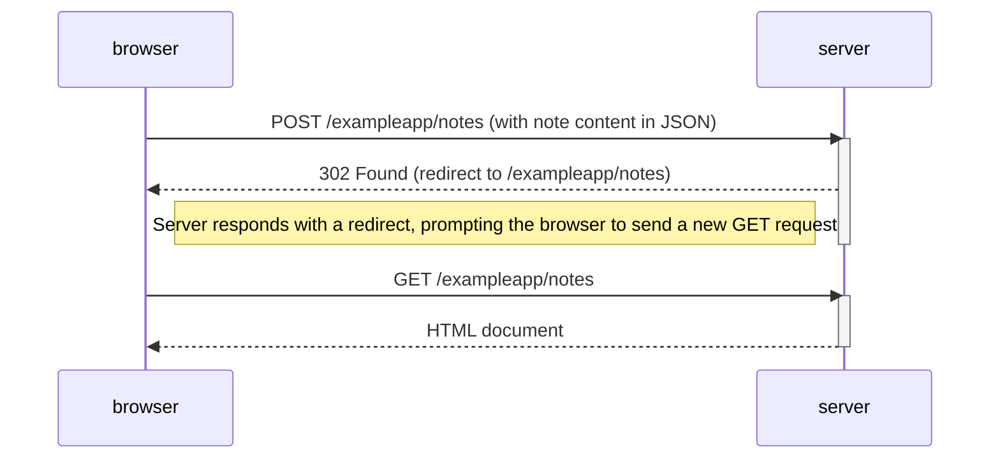

```mermaid
sequenceDiagram
    participant browser
    participant server

    browser->>server: POST /exampleapp/notes (with note content in JSON)
    activate server
    server-->>browser: 302 Found (redirect to /exampleapp/notes)
    Note right of browser: Server responds with a redirect, prompting the browser to send a new GET request
    deactivate server

    browser->>server: GET /exampleapp/notes
    activate server
    server-->>browser: HTML document
    deactivate server
```