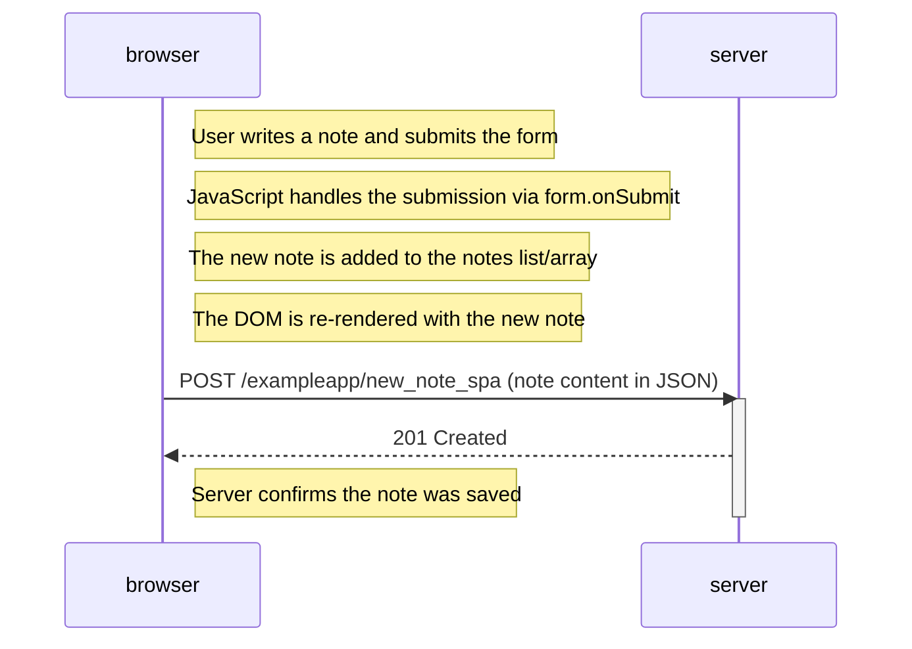

```mermaid
sequenceDiagram
    participant browser
    participant server

    Note right of browser: User writes a note and submits the form
    Note right of browser: JavaScript handles the submission via form.onSubmit
    Note right of browser: The new note is added to the notes list/array
    Note right of browser: The DOM is re-rendered with the new note

    browser->>server: POST /exampleapp/new_note_spa (note content in JSON)
    activate server
    server-->>browser: 201 Created
    Note right of browser: Server confirms the note was saved
    deactivate server
```
